# Time Manager 
### Milestone no.3 with Code Institue

### Description
---
The following project is my third Milestone project in the "Full Stack Software Developer" course with Code Institute. I would like to make a big thank you
 to my mentor Reuben Ferrante, tutor support with Code Institute (a special thanks to Tim with CI) and to the Slack community for their help thru out the project. 

My Goal is to create a mobile responsive Time manager for small and medium businesses, using what we have learn so far in HTML, CSS, js, jQuery, Flask, Mongo DB, 
Python. We could also use libaries from Materialize and Flask. We needed to deploy our project to Heroku. We had different scopes to choose from and I have chosen
 on of my own and its the Time Manager. The finished product will provide a backend functionality and a user login, but at the moment its only possible to perform CRUD 
 operations as an admin, you "login" as the administraitor (No username and password required, just click on login button). 

The project is a Time manager that allows small and medium businesses to register their employees working time, this will make it easy for the businesses to keep track
of the number of hours they spend on each project. Even if the project is not completed its possible to perform CRUD operation for the users, projects, while its only prossible
to Create and Read TimeStamps at the moment. There is no user login at the moment.  

Link to the deployed project on Heroku: https://time-management-system.herokuapp.com/ 

### UX
---
The index page have a minimum of styling and the focus have been to build the backend part for admin. From the landing page you will be able to navigate to the Faq page
and contact form, the navigation can be done from the menu at the top. As the links say you will find a Faq page with a few questions answered, where I have used Materialize's 
collapsible to create the questions and answers. The contact form is not active, so it won't fire in case someone tries to submit a message. From the login form in the middle of
 the index page you can "login" with clicking the login button. 

 Inside the dashboard for admin you will find links to view your employees, add employees, view projects, time manager, and the history of the timestamps. Settings and company 
 profile is not active and will come in a later version. 

 "View Employees" gives you a list of your employees and for each employee there is a profile where you can see all their data, from the list you can also edit and delete an employee.
 At the moment its not possible to search for a particular employee but this will be released in a later version. 

 "Add employee" and "Edit employee" gives you the possibility to add a new employee or edit an exsisting employee. Both site provides the option to the user with action buttons to either
 go back or submit the form. For each employee the following data is stored in the Mongo DB: name, employee id, DoB, full address included postal code and address, phone, country code
 and email ID. 

 Add a project will allow you to add a project to the database and the following data gets stored in the database: Project ID, Project name and Project manager. This will allow the
 employees to pick a project that they working on from a list, to record their working time inside this particular project. 

 Inside "view project" you will be able to see the projects listed.  

 "Time Manager" allows the employees (when finished) to record their working schedule, but at the time admin can record name, project id, date, started and ended work, regular hours, overtime
 and the total number of hours. 

 History provides an overview of all the hours recorded by the employees. There will later be added some search options to easy search the database for project and particular employee, but at
 the time you can see all timestamps recorded.

 The footer don't display any information but is more a line to end the page.

 ### index.html
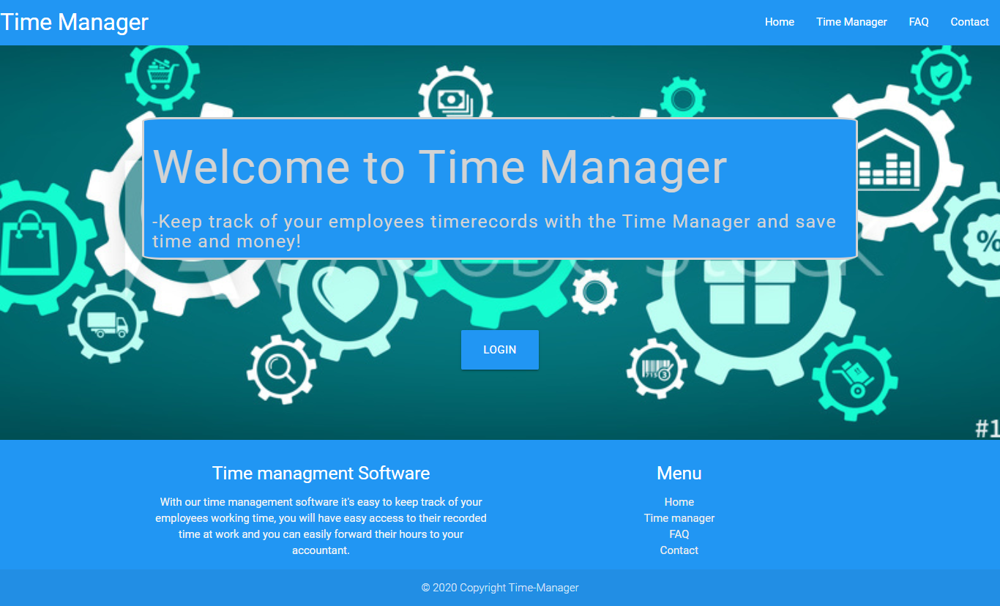

### faq.html
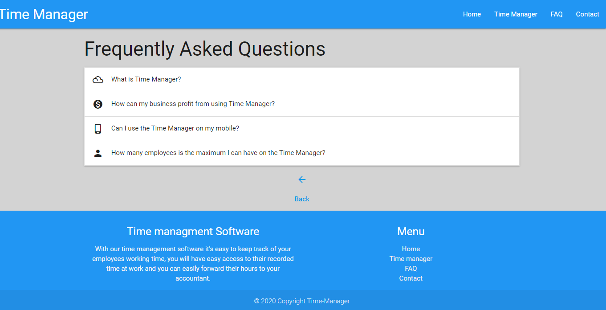

### contact.html
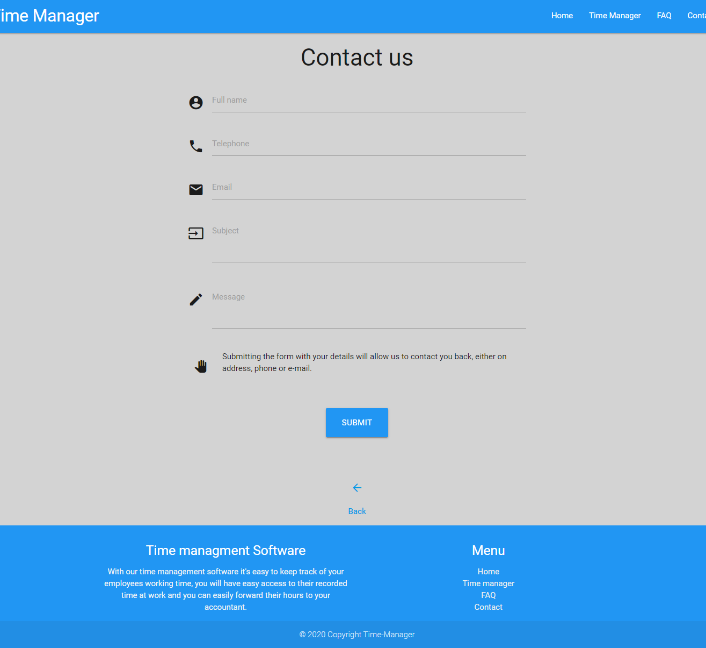

### admin_dashboard.html
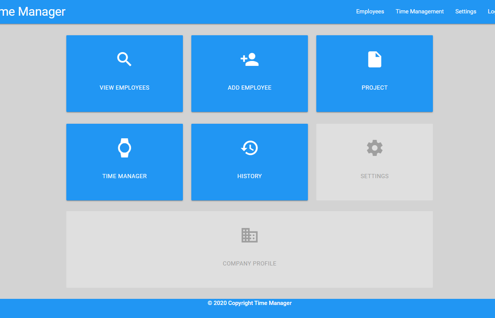

### add_project.html
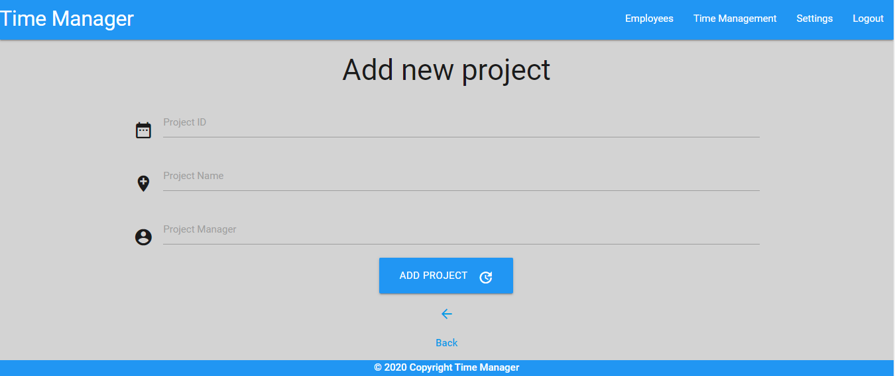

### see_project.html
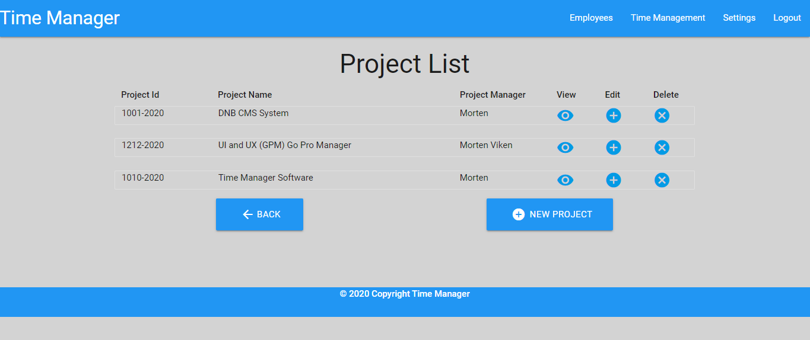

### edit_project.html


### add_user.html
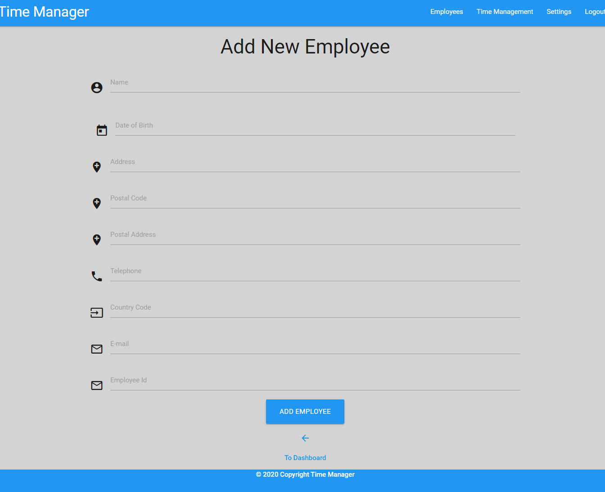 

### view_employees.html
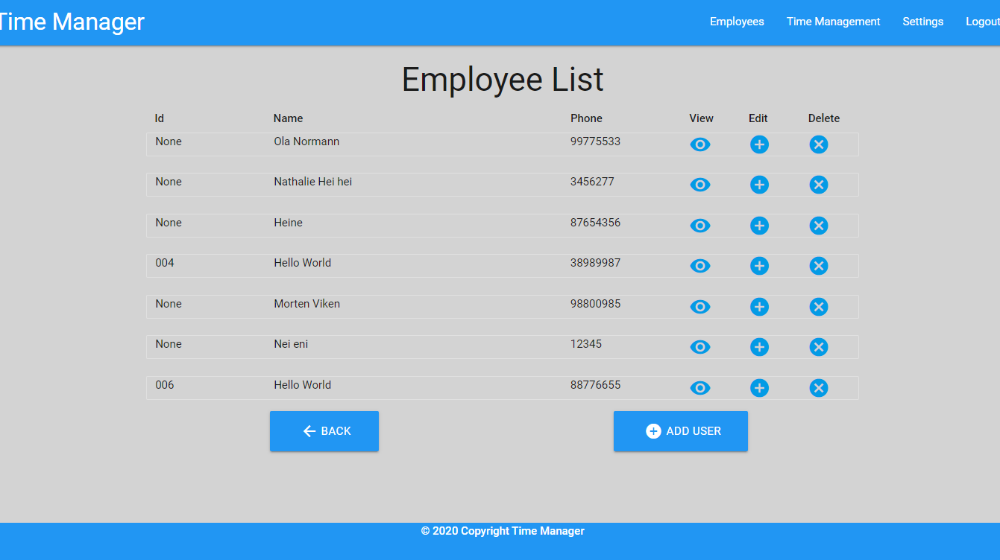

### edit_employees.html
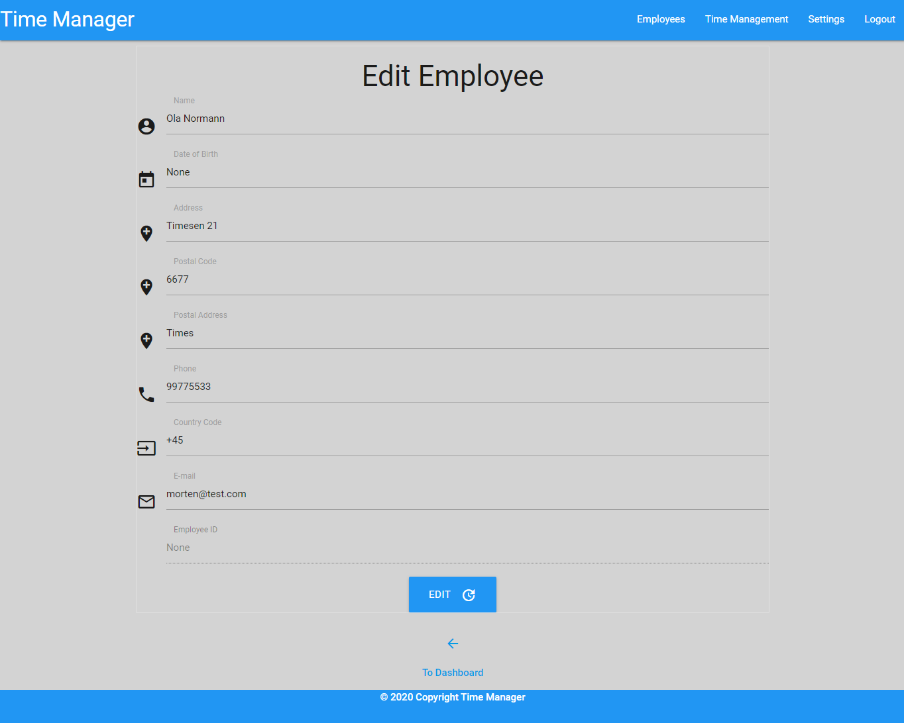 

### profile.html
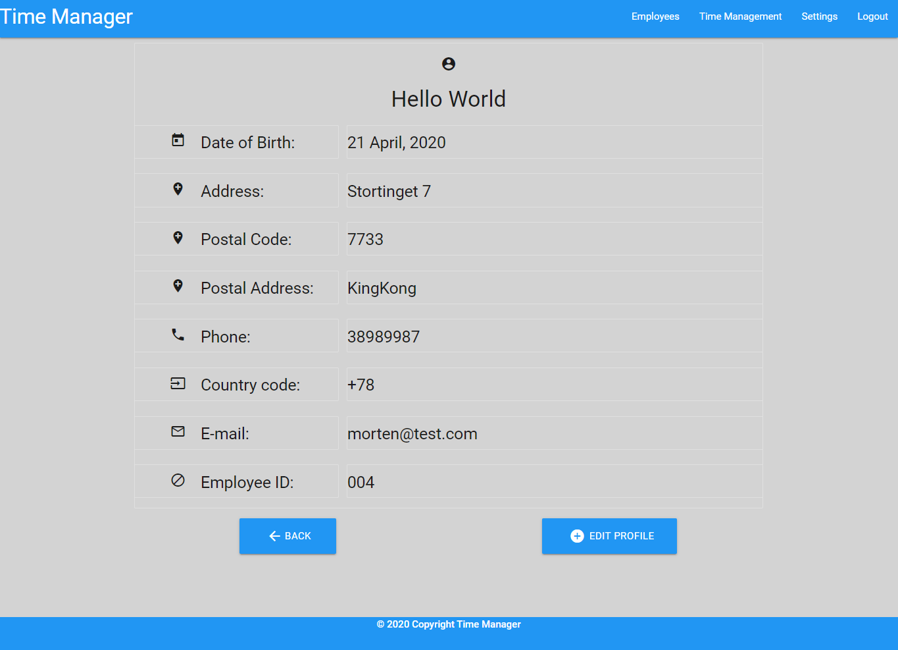 

### time_manager.html
 

### history.html
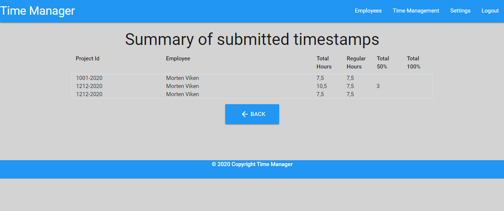 

### Features
---
#### Current Features
---
```sh
* Index - The user will find links to Faq, contact form and a login form that directs them to the admin dashboard
* FAQ - Answers a few things about the Time manager
* Contact - A unactive contact form
* Admin Dashboard - Links to View Employee, Add Employee, See projects, Time Manager and History
* View Employees - See a list of all employees and their id, and phone number. You have action buttons to edit, delete and to enter their profiles for more data about the employee.
* Add Employee - Here admin adds new employees to his company. 
* Edit employee - Here its possible to edit an employee.
* Projects - Admin will see a list of all projects and will have the options to edit and delete projects as well as creating a new project.
* Time manager - The Time Manager allows the employees to record their working time. They will input their name, project id, start time, end time, the regular hours and overtime before the total.
* History - See all timestamps recored by employees and it will show the project id, employee name, and date and recorded hours.

#### Future Feature
---
```sh
* Build as a SaaS Platform.
* Both Norwegian and English language
* User accounts - There will be separate Admin, subadmin and Employee accounts.
* View Employee - Search for particular employee by employee Id or name.
* View Employee - Add pop-up window to verify if admin are sure they want to delete employee.
* Add Employee - Automatic number generator for Employee_id
* Projects - Add pop-up window to verify if admin are sure they want to delete projects.
* Time manager - Have a timer installed, making the Time Manager automatically generates what's overtime, regulartime and the total. 
* Verify - There will be a possibility to verify the timestamps from the project manager or admin.
* History - Search for a particular employee to see all the timestamps, separate the timestamps for each project. 
* Setting - A control panel will be developed to give admin easy control over his Time Manager. 
* Get my Flashed messages displayed in a better and more correct way.
* Company profile page

### Technologies / Support used.
---
Below is a list of technologies I've used to build my website and application
* HTML - HTML5 Provided the content and the structure of my website and time manager software. 
* CSS - CSS were used to style my site and application. 
* [Materialize](https://materializecss.com/) - I've used Materialize for framework, forms, section-spacing and icons.
* [Gitpod](https://www.gitpod.io/) I've used Gitpod as my text editor. It offer everything I need to do from one enviroment. 
* [Git](https://git-scm.com) - Git was used for version control and pushing the code to GitHub
* [GitHub](https://github.com/) - This is where my repository is held externally.
* [Javascript/JQuery](https://jquery.com/) - Where use to have a ready function to activate my Materialize colapsible and navbar.
* [Mongo DB](https://www.mongodb.com/) - I've used Mongo DB for databases
* [Python](https://www.python.org/) - I've used Python version 3 to write my Python files
* [Flask](https://flask.palletsprojects.com/en/1.1.x/) - I've used Flask for rendering my templates, url_for, requests
* [PyMongo](https://docs.mongodb.com/) - I've used PyMongo package as my native Python driver for MongoDB. 
* [BSON](http://bsonspec.org/) - I've used BSON for my Object Id.  
* [Heroku](https://www.heroku.com/) - I've deployed my code to Heroku. 

### Testing 
--- 
I've tested the site and application both manually and automatically throughout the development of the project. I've used the web developer tools to see that my site was responsive at all
time. Even if some of the components needs to be better scaled the application is still responsive. I've used mobile first approch and then testing to scale it to tables and larger desktops. 
I've tested to see that the application scales in all devices. The automatic checks of my HTML and CSS structure were done in [W3C Validator](https://validator.w3.org/#validate_by_input) to
 ensure there isn't any errors in the code and that the structure is correct. I have tested the site on Firefox, Internet explorer and Chrome to see that the site scales properly, as well as
all features and framework is correct in it's positions. Everything scales nicely. 

### Bugs
--- 
Editing users: When editing Employees the Employee_id and the DoB changes in the Database to "NULL" even if you change it or not. 
Due to not being able to fix my navbar so it scaled when used on tablets and mobiles, its not possible to navigate to contact and the FAQ pages from devices with smaller screen sizes

### Deployment
---
My website and application was created using GitPod, they provide me with free credits as a student and their platform have 
buildt in Terminal that allows me to push my code to GitHub. GitPod allows you to store your username and password and
thus makes the experience pushing your code to GitHub easier. I have also pushed my code to Heroku to create it into a Heroku app.

#### GitHub and GitPod
* Create your project in GitHub and open it with GitPod directly from GitHub. 
* Created all my folder and files.
* Use "git add ." into the bash terminal
* Use "git commit" into the bash terminal and create "initial commit"
* Use "git push" into the bash terminal and push your code to GitHub
* Follow the below steps to deploy the site to GitHub pages. 

#### To deploy the application to Heroku follow the steps below:
* Create your free Heroku account
* Choose to create a new app
* Give your app a name
* Install the Heroku CLI
* Login to Heroku from your CLI
* Deploy your code to Heroku using git commands
* git add .
* git commit -m "Inintial Heroku commit"
* git push heroku master
* Go to settings and set your config vars values
* IP - 0.0.0.0
* PORT - 5000
* At the top on the right side you can find a button name "Open App" use it to to see your deployed project: https://time-management-system.herokuapp.com/


##### To deploy the website to GitHub pages follow the below steps:
* Select the "Time-Management-Software" from my GitHub dashboard.
* Select "Settings" from the menu bar. 
* From the GitHub pages section, I chose "master branch" from the dropdown menu. 
* Once selected, the page refreshes and a link will be displayed in the GitHub section to my website.
* Link to the project: <a href="https://time-management-system.herokuapp.com/>Click here</a>  

### To run this project locally
---
* Follow this link to the [GitHub Repositiry](https://github.com/weekend79/time-management-software)
* Click on the 'Clone or Download' button.
* Copy the URL provided.
* Open a bash terminal, move to your desired directory.
* Type 'git clone' and paste in the URL.

### Contributing
---
* To my mentor [Reuben Ferrante](https://github.com/arex18), for giving me exellent guidens thru the project and assisted me in some important issue's.
* [W3C Validator](https://validator.w3.org/#validate_by_input) - A validator used to check my HTML and CSS structure and format periodically throughout the build.
* [W3Schools](https://www.w3schools.com/) - I used this to ensure I was entering all the information required correctly in my HTML and CSS.
* [Tutor Support](https://codeinstitute.net/) - I used turtor support thruout the project and they have been excellent support.
* [Slack community](https://slack.com/) - For a some of my issues I have turn to the Slack community and they have provided me with excellent tips and tricks to use in my development 

### Author

* **Morten Viken** - *Initial work* - [weekend79](https//github.com/weekend79)